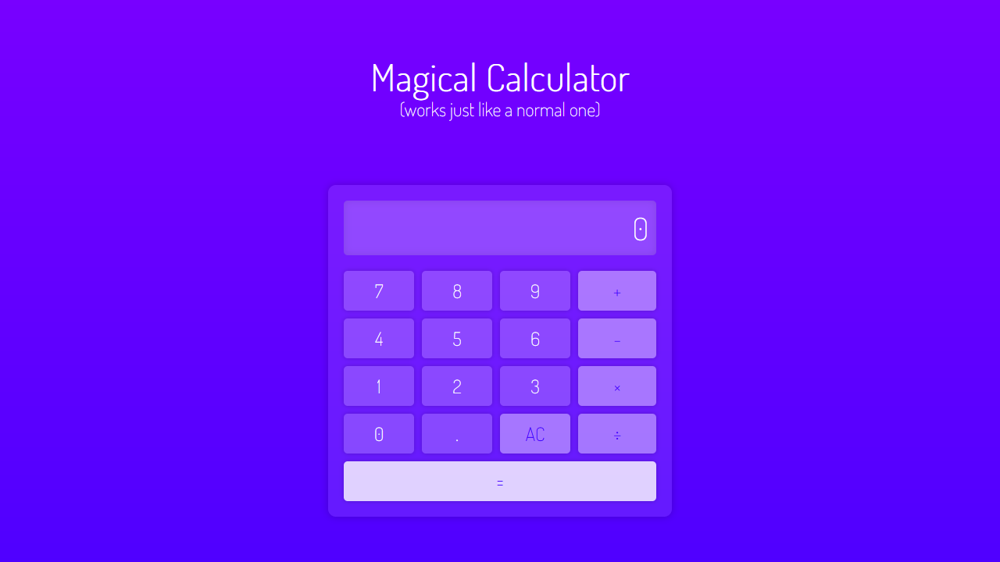

# JS Calculator

JS Calculator is a simple web-based calculator application built with HTML, CSS, and JavaScript. It can perform basic arithmetic operations such as addition, subtraction, multiplication, and division.

## Features

- Addition, subtraction, multiplication, and division.
- Clear button to reset the calculator.

## Getting Started

These instructions will get you a copy of the project up and running on your local machine for development and testing purposes.

### Prerequisites

- A web browser

### Installing

1. Clone the repository to your local machine.

    `git clone https://github.com/enrique-paulino/js-calculator.git`
    
2. Open `index.html` in your web browser.

## Built With

- HTML
- CSS
- JavaScript
