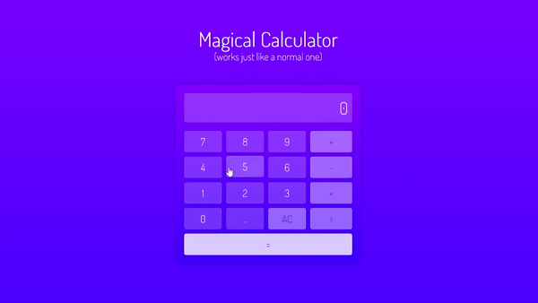

# JS Calculator

🧮 This project is a simple web-based calculator application built with HTML, CSS, and JavaScript. It can perform basic arithmetic operations such as addition, subtraction, multiplication, and division.

## 🌟 Features of the calculator include:
- User-friendly interface with a magical touch 🧙‍♀️
- Addition, subtraction, multiplication, and division
- AC button to clear the input field
- CE button to delete the last digit entered

## 🚀 Getting Started

These instructions will get you a copy of the project up and running on your local machine for development and testing purposes.

### Prerequisites

- A web browser

### Installing

1. Clone the repository to your local machine.
2. Open `index.html` in your web browser.

## 💻 Usage
Simply enter numbers and operators using the on-screen buttons to perform calculations. The result will be displayed in the calculator display.

## 🙏 Credit

This calculator was built as part of my project-based learning journey in JavaScript. I followed the tutorial ["How to Build an HTML Calculator App from Scratch Using JavaScript"](https://www.freecodecamp.org/news/how-to-build-an-html-calculator-app-from-scratch-using-javascript-4454b8714b98) by Zell Liew from FreeCodeCamp.
